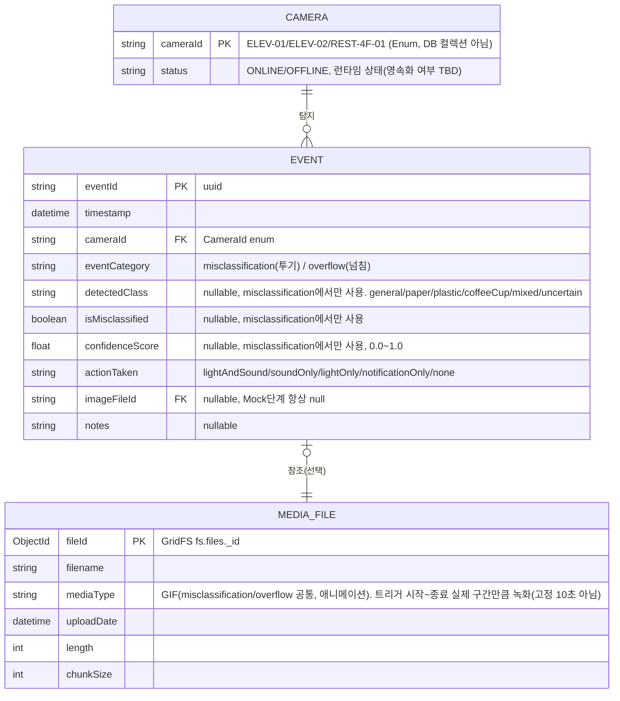

# ERD — CCTV 기반 분리수거 오분류 탐지·자동 경고 시스템

> 버전: MVP(Mock 단계) 기준. `WebApps/backend` 코드가 아직 커밋되지 않아 `Docs/API_SPEC.md` / `.agentfiles/apiSpec.md` / `architecture.md` 명세를 근거로 작성함.
> 실제 영속화되는 것은 MongoDB `events` 컬렉션 + GridFS뿐. `CAMERA`/`SystemState`는 현재 DB 컬렉션이 아니라 Enum·런타임 상태라 참고용으로만 표시.
> 2단계 탐지 파이프라인(Nano 상시감시 + Medium 정밀분석)에 따라 이벤트가 `misclassification`(투기)/`overflow`(넘침) 두 카테고리로 나뉨 — `architecture.md` 참고.

## ER 다이어그램

## 참고

- **EVENT**: 실제 MongoDB 컬렉션(`repositories/eventRepository.py`, motor 기반으로 완전 전환 — in-memory Mock 제거). 매 프레임이 아니라 투기/넘침 판정 시점에만 Insert됨.
  - `misclassification`: 동일 `cameraId`+`detectedClass` 5초 Cooldown
  - `overflow`: 동일 `cameraId` 기준 Cooldown(초 단위 TBD, 현재는 5초로 가정) — 분류 단계 없이 감지 즉시 생성
- **MEDIA_FILE**: MongoDB GridFS(`fs.files`+`fs.chunks`) 표준 구조. `misclassification`/`overflow` 둘 다 GIF로 저장(`services/mediaService.py`가 OpenCV 프레임을 Pillow로 인코딩, `repositories/mediaRepository.py`가 업로드), 필드명은 `imageFileId`로 공용. 녹화 길이는 고정 10초가 아니라 `services/recordingService.py`가 시작~종료 신호 사이 실제 구간을 캡처(신호 유실 대비 최대 30초 안전 캡). 탐지 서비스가 아직 없어 실제 트리거 전이라 `imageFileId`는 대부분 `null`.
- **CAMERA**: 별도 컬렉션 없음. `CameraId` Enum + 설정값으로만 존재하는 개념적 엔티티. 3대 고정(`ELEV-01`, `ELEV-02`, `REST-4F-01`).
- **통계(`GET /api/statistics`)**: 저장 없이 매 요청마다 `EVENT`에서 온디맨드 집계 — 별도 엔티티 아님. `overflow` 포함 여부는 TBD.
- **SystemState.mode**(`MANAGE`/`COLLECT`): 전역 상태로만 언급되고 영속화 계층(DB/파일) 명시 없어 ERD에서 제외.
- 2단계 탐지 모델(YOLOv8-Nano/Medium) 자체는 DB에 영속화되는 대상이 아니라 GPU 서버 내 추론 컴포넌트라 ERD 범위 밖.

## TBD (ERD에 영향 줄 수 있는 항목)

- 학습용 원본 이미지 저장 방식: GridFS 재사용 vs GPU 서버 로컬 디스크 축적 (`architecture.md`)
- `CameraStatus`, `SystemState.mode`의 영속화/컬렉션화 여부
- `overflow` 이벤트의 Cooldown 기준(현재 misclassification과 동일 5초로 가정, 재검토 필요)
- 통계에 `overflow` 건수 포함/분리 집계 여부
- `mixed`/`uncertain` 클래스 세부 정의가 `EVENT.detectedClass` 스키마에 영향 줄 수 있음

## 해결된 TBD

- 이미지/영상 필드 공용 여부 → `imageFileId` 하나로 공용 확정. `misclassification`/`overflow`
  둘 다 GIF로 저장(별도 `videoFileId` 안 둠). 녹화 길이도 고정 10초가 아니라 트리거
  시작~종료 신호 사이 실제 구간으로 계산(`services/recordingService.py`)
