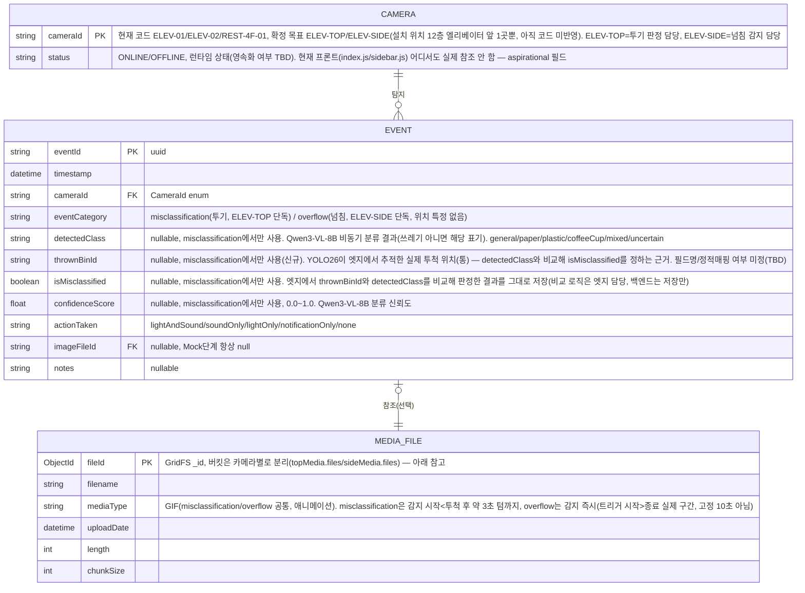

# ERD — CCTV 기반 분리수거 오분류 탐지·자동 경고 시스템

> 버전: MVP 기준. `repositories/eventRepository.py`가 motor(비동기 MongoDB 드라이버) 기반으로 구현됨(in-memory Mock 제거 완료) — `WebApps/backend/schemas/event.py`의 Pydantic 모델을 근거로 작성.
> 실제 영속화되는 것은 MongoDB `events` 컬렉션 + GridFS뿐. `CAMERA`/`SystemState`는 현재 DB 컬렉션이 아니라 Enum·런타임 상태라 참고용으로만 표시.
> 손 감지 조합 판정은 폐지되고 쓰레기 감지 자체가 트리거로 바뀜 — 옆 카메라는 넘침 감지 시
> 바로 알림(위치 특정 없음), 위 카메라는 엣지(젯슨) YOLO26 추적 + 중앙(GPU) Qwen3-VL-8B
> 비동기 분류 결과를 **엣지에서 종합 판정**(백엔드가 아니라 엣지가 판정 주체). 이벤트는
> 여전히 `misclassification`(투기)/`overflow`(넘침) 두 카테고리로 나뉨. 상세는
> `architecture.md`의 "탐지 파이프라인" 참고.

## ER 다이어그램

## 참고

- **EVENT**: 실제 MongoDB 컬렉션(`repositories/eventRepository.py`, motor 기반으로 완전 전환 — in-memory Mock 제거). 매 프레임이 아니라 투기/넘침 판정 시점에만 Insert됨.
  - `misclassification`: 동일 `cameraId`+`detectedClass` 5초 Cooldown
  - `overflow`: 동일 `cameraId` 기준 Cooldown(초 단위 TBD, 현재는 5초로 가정) — 분류 단계 없이 감지 즉시 생성
- **MEDIA_FILE**: MongoDB GridFS 구조, **버킷을 카메라별로 2개 분리**(`topMedia`/`sideMedia` —
  각각 `<bucket>.files`+`<bucket>.chunks`, 기본 버킷명 `fs` 하나만 쓰던 걸 카메라별로 나눔).
  저장 시 `EVENT.cameraId`(위 카메라→`topMedia`, 옆 카메라→`sideMedia`) 기준으로 버킷 선택,
  조회 시에도 동일 기준으로 버킷을 찾아야 함(`imageFileId`만으로는 버킷 특정 불가). 순수
  저장 구조 관리 편의 목적 — 보관 기간 등 정책 차이는 없음(TTL/보관정책 분리는 미정,
  필요해지면 별도 논의). `misclassification`/`overflow` 둘 다 GIF로 저장(`services/mediaService.py`가
  OpenCV 프레임을 Pillow로 인코딩, `repositories/mediaRepository.py`가 업로드), 필드명은
  `imageFileId`로 공용. 녹화 길이는 고정 10초가 아니라 `services/recordingService.py`가
  시작~종료 신호 사이 실제 구간을 캡처(신호 유실 대비 최대 30초 안전 캡) — `misclassification`은
  투척 완료 후 약 3초 텀을 두고 종료 신호가 옴(`architecture.md`). 탐지 서비스가 아직 없어
  실제 트리거 전이라 `imageFileId`는 대부분 `null`.
- **CAMERA**: 별도 컬렉션 없음. `CameraId` Enum + 설정값으로만 존재하는 개념적 엔티티. 현재 코드는 3개 고정(`ELEV-01`, `ELEV-02`, `REST-4F-01`) — 확정된 목표는 `ELEV-TOP`/`ELEV-SIDE`(설치 위치 1곳, 아직 코드 미반영, `.agentfiles/architecture.md` 참고).
- **통계(`GET /api/statistics`)**: 저장 없이 매 요청마다 `EVENT`에서 온디맨드 집계 — 별도 엔티티 아님. `overflow` 포함 여부는 TBD.
- **SystemState.mode**(`MANAGE`/`COLLECT`): 전역 상태로만 언급되고 영속화 계층(DB/파일) 명시 없어 ERD에서 제외.
- 탐지 모델(YOLO26/Qwen3-VL-8B) 자체는 DB에 영속화되는 대상이 아니라 GPU 서버 내 추론 컴포넌트라 ERD 범위 밖.
- **DB 실행 위치**: MongoDB가 GPU 서버(`e8000`)의 docker compose 스택(`mongo` 컨테이너)으로 이전됨.
  팀 공유 서버(`.30`)와는 별개 인스턴스라 계정도 새로 생성(`root`+`user01`~`05`, `sortMaster` DB에
  `readWrite`). `backend` 컨테이너는 `MONGO_HOST=mongo`/`DB_PORT=27017`(내부망), 외부에서 직접
  붙을 땐 SSH 터널로 `localhost:27020`(`gpuServerOps.md` 참고) — ERD의 엔티티 구조 자체엔 영향 없음.

## TBD (ERD에 영향 줄 수 있는 항목)

- 학습용 원본 이미지 저장 방식: GridFS 재사용 vs GPU 서버 로컬 디스크 축적 (`architecture.md`)
- `CameraStatus`, `SystemState.mode`의 영속화/컬렉션화 여부
- `overflow` 이벤트의 Cooldown 기준(현재 misclassification과 동일 5초로 가정, 재검토 필요)
- 통계에 `overflow` 건수 포함/분리 집계 여부
- `mixed`/`uncertain` 클래스 세부 정의가 `EVENT.detectedClass` 스키마에 영향 줄 수 있음
- **`thrownBinId`의 "원래 어떤 클래스용 통인지" 매핑 방식**: `EVENT`에 필드 자체를 추가하는
  건 확정(아래 "해결된 TBD" 참고)이지만, 통-클래스 매핑을 정적 설정(카메라/통 위치별 고정
  매핑, DB에 안 남김)으로 할지 `EVENT`에 `expectedClass` 같은 필드를 추가로 남길지는 미정.
  현재 스키마(`schemas/event.py`)엔 아직 `thrownBinId` 자체도 없고 비교 로직도 미구현
- **`GET /api/events`/`/api/events/{id}` 응답에 `thrownBinId` 반영**: 필드가 스키마에 추가되면
  `static/js/eventsList.js`의 `convertEventToRow()`도 `loc: eventData.cameraId`(임시 대체)
  대신 실제 `thrownBinId`를 쓰도록 고쳐야 함

## 해결된 TBD

- **`EVENT`에 "배출 위치" 필드 추가 확정** → `thrownBinId`(가칭)로 위 ER 다이어그램에 반영.
  대시보드가 "위치"(cameraId)와 "배출 위치"(어느 통에 들어갔는지)를 별도 컬럼으로 요구했고,
  프론트(`eventsList.js`)에 이미 이 갭의 흔적(cameraId로 임시 대체하던 주석)이 있어서 확정
- **`EVENT` 컬렉션은 카메라별로 물리 분리하지 않기로 확정** → `GET /api/events`가 `cameraId`
  필터 없이 전 카테고리를 한 컬렉션에서 조회하는 구조(`services/eventService.py`의
  `getEvents()`)라, 물리 DB를 나누면 매번 여러 DB를 쿼리해서 합쳐야 함. `cameraId` 필드
  하나로 이미 카메라별 구분이 가능해서 컬렉션 하나로 유지
- **영상(GridFS) 저장은 카메라별로 버킷 2개(`topMedia`/`sideMedia`)로 분리 확정** → 위
  `EVENT`와는 별개 결정. 물리 DB가 아니라 같은 DB 안 GridFS 버킷만 나누는 거라 연결/인증
  추가 없이 저장 구조만 정리됨. 목적은 순수 관리 편의(보관정책 차이 아님) — `EVENT`를
  한 컬렉션으로 유지하기로 한 결정과 모순 아님(조회 시 카메라 통합이 필요 없는 미디어
  블롭 저장소라 나눠도 조회 편의성 손해가 없음)

- 이미지/영상 필드 공용 여부 → `imageFileId` 하나로 공용 확정. `misclassification`/`overflow`
  둘 다 GIF로 저장(별도 `videoFileId` 안 둠). 녹화 길이도 고정 10초가 아니라 트리거
  시작~종료 신호 사이 실제 구간으로 계산(`services/recordingService.py`)
