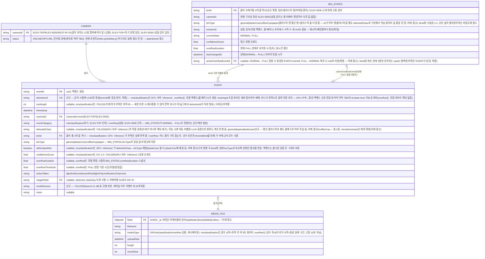

# ERD — CCTV 기반 분리수거 오분류 탐지·자동 경고 시스템

> 버전: 고도화 진행 중(MVP 데모 완료). `repositories/eventRepository.py`가 motor(비동기 MongoDB 드라이버) 기반으로 구현됨(in-memory Mock 제거 완료) — `WebApps/backend/schemas/event.py`의 Pydantic 모델을 근거로 작성. **`detectionId`/`trackingId`/`binId`/`binType`/`modelVersion`과 카메라별 GridFS 버킷은 코드 반영 완료. `BIN_STATES`만 아직 코드 반영 전임.**
> 실제 영속화되는 것은 MongoDB `events`/`binStates`(신규) 컬렉션 + GridFS뿐. `CAMERA`/`SystemState`는 현재 DB 컬렉션이 아니라 Enum·런타임 상태라 참고용으로만 표시.
> 손 감지 조합 판정은 폐지되고 쓰레기 감지 자체가 트리거로 바뀜 — 옆 카메라(`ELEV-SIDE`)는
> **룰 베이스로 로컬 백엔드가 직접**(GPU 미사용) 물리 쓰레기통 4개(일반/플라스틱·캔/커피컵/
> 종이)의 상태를 `BIN_STATES`로 지속 추적하다가 **NORMAL→FULL로 전환되는 순간에만** 넘침
> 이벤트 생성+알림. 위 카메라(`ELEV-TOP`)는 **GPU 서버 `inference`의 YOLO26**이 투척 추적+
> 쓰레기 종류 분류를 계속 수행하고, 로컬 백엔드가 통 상태/쿨다운과 종합해 최종 판정(메인보드가
> 라즈베리파이로 바뀌면서 엣지가 아니라 GPU 서버가 추론 주체). Qwen3-VL-8B(LLM)는 실시간
> 탐지 경로엔 없고 학습 준비 단계 자동 라벨링 검증에 이미 사용 중(`architecture.md`의
> "LLM 활용" 참고). 이벤트는 여전히
> `misclassification`(투기)/`overflow`(넘침) 두 카테고리로 나뉨. 상세는 `architecture.md`의
> "탐지 파이프라인" 참고.

## ER 다이어그램

## 참고

- **EVENT**: 실제 MongoDB 컬렉션(`repositories/eventRepository.py`, motor 기반으로 완전 전환 — in-memory Mock 제거). 매 프레임이 아니라 판정 시점에만 Insert됨.
  - `misclassification`: 동일 `cameraId`+`detectedClass` 5초 Cooldown(기존과 동일, 유지)
  - `overflow`: 더 이상 시간 기반 Cooldown이 아님 — `BIN_STATES.currentState`가 `NORMAL`→`FULL`로
    전환되는 순간에만 1건 생성. `FULL` 상태가 계속 유지되는 동안은 재알림 없음(현재 상태는
    `BIN_STATES`로 실시간 조회 가능)
  - `detectionId`(신규, UK)로 DB 레벨 중복 저장 방지 — 시간 기반 Cooldown(스팸성 재감지 방지)과는
    별개 문제(네트워크 재전송 등으로 인한 중복 방지)라 둘 다 유지
- **BIN_STATES**(신규): 물리 쓰레기통 4개(일반/플라스틱·캔/커피컵/종이) 각각의 현재 상태를
  지속 추적하는 컬렉션 — 기존엔 없던 개념. `EVENT`처럼 시점성 로그가 아니라 **각 `binId`당
  최신 상태 1행만 유지**(upsert, 확정 — 이력은 `EVENT`가 담당). `currentState`가
  `NORMAL`→`FULL`로 바뀌는 순간 `EVENT`(overflow)를 생성하고 그 `eventId`를
  `activeOverflowEventId`에 기록. 아직 `schemas/`·`repositories/`에 코드 없음(설계만 확정)
- **MEDIA_FILE**: MongoDB GridFS 구조, **버킷을 카메라별로 2개 분리**(`topMedia`/`sideMedia` —
  각각 `<bucket>.files`+`<bucket>.chunks`, 기본 버킷명 `fs` 하나만 쓰던 걸 카메라별로 나눔).
  저장 시 `EVENT.cameraId`(위 카메라→`topMedia`, 옆 카메라→`sideMedia`) 기준으로 버킷 선택,
  조회 시에도 동일 기준으로 버킷을 찾아야 함(`imageFileId`만으로는 버킷 특정 불가). 순수
  저장 구조 관리 편의 목적 — 보관 기간 등 정책 차이는 없음(TTL/보관정책 분리는 미정,
  필요해지면 별도 논의). `misclassification`/`overflow` 둘 다 GIF로 저장(`services/mediaService.py`가
  OpenCV 프레임을 Pillow로 인코딩, `repositories/mediaRepository.py`가 업로드), 필드명은
  `imageFileId`로 공용. 녹화 길이는 고정 10초가 아니라 `services/recordingService.py`가
  시작~종료 신호 사이 실제 구간을 캡처(신호 유실 대비 최대 30초 안전 캡) — `misclassification`은
  투척 완료 후 약 3초 텀을 두고 종료 신호가 옴(`architecture.md`). 탐지 서비스가 아직 없어
  실제 트리거 전이라 `imageFileId`는 대부분 `null`.
- **CAMERA**: 별도 컬렉션 없음. `CameraId` Enum + 설정값으로만 존재하는 개념적 엔티티. 현재 코드는 3개 고정(`ELEV-TOP`, `ELEV-SIDE`, `REST-4F-01`) — `.agentfiles/architecture.md` 참고.
- **통계(`GET /api/statistics`)**: 저장 없이 매 요청마다 `EVENT`에서 온디맨드 집계 — 별도 엔티티 아님. `overflow`는 `detectedClass`별 집계에 안 섞고(애초에 `detectedClass`가 없음), `overflowCount` 같은 별도 필드로 분리 집계(확정 — 성격이 다른 카테고리를 같은 막대그래프에 억지로 합치면 오히려 헷갈림).
- **SystemState.mode**(`MANAGE`/`COLLECT`): 전역 상태로만 언급되고 영속화 계층(DB/파일) 명시 없어 ERD에서 제외.
- 탐지 모델(TOP=YOLO26/GPU 서버 `inference` 상시 추론, SIDE=룰 베이스/로컬 백엔드, Qwen3-VL-8B=GPU 서버 학습용 자동 라벨링 검증) 자체는 DB에 영속화되는 대상이 아니라 ERD 범위 밖.
- **DB 실행 위치**: MongoDB는 **로컬**(`<LOCAL_BACKEND_IP>`, 실제 값은 Notion 참고)에서 `backend`와 같이 구동(배포
  위치 재조정 확정 — GPU 서버로 이전했던 건 보류됨, `.agentfiles/architecture.md` 참고).
  `training`(GPU 서버)이 학습용 이미지를 가져올 때만 역방향 SSH 터널로 이 DB에 접속 —
  ERD의 엔티티 구조 자체엔 영향 없음.

## 해결된 TBD

- **`GET /api/events`/`/api/events/{id}` 및 이전기록 화면에 `binId` 반영 완료** →
  Event 스키마·MongoDB 문서·`eventsList.js`가 모두 실제 `binId`를 사용
- **물리 쓰레기통 구성 확정** → 카메라에 4개(일반/플라스틱·캔/커피컵/종이)가 잡힘.
  `binId`가 이 4개 중 하나를 가리키는 걸로 확정 — 이전에 고민했던 "카메라 위치 특정 폐지"와는
  다른 층위(카메라 역할 분담 vs 개별 통 식별)라 서로 모순 아님
- **`EVENT`에 "배출 위치" 필드 추가 확정, 필드명은 `binId`로 정리** → 과거 초안에서
  `thrownBinId`로 불렀던 걸 `binId`로 통일(overflow 이벤트에도 쓰이게 되면서 "투척"이라는
  이름이 misclassification 전용처럼 보여서 변경). 대시보드가 "위치"(cameraId)와 "배출
  위치"(어느 통에 들어갔는지)를 별도 컬럼으로 요구했고, 프론트(`eventsList.js`)에 이미 이
  갭의 흔적(cameraId로 임시 대체하던 주석)이 있어서 확정
- **`isMisclassified` 판정 시 "원래 어떤 클래스용 통인지" 매핑 방식 확정** → 별도
  `expectedClass` 필드 없이, `binType`(= binId가 가리키는 통의 고정 종류)을 `detectedClass`와
  비교해서 판정. `binType`이 사실상 정적 매핑 역할을 함
- **넘침(overflow) 이벤트 생성 기준을 시간 Cooldown → 상태 전환으로 확정** → `BIN_STATES`로
  통별 `NORMAL`/`FULL` 상태를 지속 추적하다가 `NORMAL`→`FULL`로 바뀌는 순간에만 `EVENT` 생성.
  기존 "동일 카메라 기준 5초 Cooldown(가정)" 방식 폐기
- **`detectionId`(중복 방지)/`trackingId`(YOLO 추적 ID)/`modelVersion` 필드 추가 확정** →
  `detectionId`는 DB 유니크 인덱스로 중복 저장 방지(misclassification은 GPU 서버↔중앙
  백엔드 신호 전달이 at-least-once일 가능성 대비, overflow는 로컬 백엔드 내부 생성이라
  해당 없음 — 시간 기반 Cooldown과는 별개 목적). `trackingId`는 디버깅/추적용(전역
  유니크 아님). `modelVersion`은 재학습 이후 이벤트 비교용
- **`EVENT` 컬렉션은 카메라별로 물리 분리하지 않기로 확정** → `GET /api/events`가 `cameraId`
  필터 없이 전 카테고리를 한 컬렉션에서 조회하는 구조(`services/eventService.py`의
  `getEvents()`)라, 물리 DB를 나누면 매번 여러 DB를 쿼리해서 합쳐야 함. `cameraId` 필드
  하나로 이미 카메라별 구분이 가능해서 컬렉션 하나로 유지
- **영상(GridFS) 저장은 카메라별로 버킷 2개(`topMedia`/`sideMedia`)로 분리 확정** → 위
  `EVENT`와는 별개 결정. 물리 DB가 아니라 같은 DB 안 GridFS 버킷만 나누는 거라 연결/인증
  추가 없이 저장 구조만 정리됨. 목적은 순수 관리 편의(보관정책 차이 아님) — `EVENT`를
  한 컬렉션으로 유지하기로 한 결정과 모순 아님(조회 시 카메라 통합이 필요 없는 미디어
  블롭 저장소라 나눠도 조회 편의성 손해가 없음)
- 이미지/영상 필드 공용 여부 → `imageFileId` 하나로 공용 확정. `misclassification`/`overflow`
  둘 다 GIF로 저장(별도 `videoFileId` 안 둠). 녹화 길이도 고정 10초가 아니라 트리거
  시작~종료 신호 사이 실제 구간으로 계산(`services/recordingService.py`)
- **`binType`은 `plasticCan` 유지, `DetectedClass`에 `can` 추가하는 걸로 확정** → 물리 통은
  플라스틱과 캔을 같이 받지만(`plasticCan` 통 1개), AI 학습은 이미 캔/플라스틱을 별도
  클래스로 구분 중이라 `DetectedClass`를 값 통일하는 대신 `can`을 추가하는 쪽으로 결정
  (한때 `plastic`으로 값 통일하는 안을 검토했다가 번복). `DetectedClass`의 "클래스 경계 =
  목표 통 경계" 원칙(커피컵 몸체=`coffeeCup`/뚜껑=`plastic`처럼 재질이 아니라 배출 통
  기준으로 나뉨)은 그대로 유지되지만, `plasticCan` 통 하나에 `plastic`/`can` 클래스 둘 다
  대응되는 **다대일 관계**라 `isMisclassified` 판정에 매핑(`{plastic: plasticCan, can:
  plasticCan, paper: paper, coffeeCup: coffeeCup, general: general}`)이 필요 —
  `schemas/event.py`의 `DetectedClass`에 `can` 값 추가 완료
- **`DetectedClass`에서 `mixed`/`uncertain` 제외 확정** → 라벨링 기준을 정하려다가, 팀
  자체 라벨링 시엔 어차피 모든 대상을 5종(general/paper/plastic/can/coffeeCup) 중
  하나로 분류할 수 있다고 판단해서 아예 클래스에서 뺌. `DetectedClass`가 `binType`(4종)에
  다대일로 완전히 매핑되는 닫힌 집합이 되어, "매핑 없는 값" 예외 처리 자체가 불필요해짐
  (예전에 검토했던 "mixed/uncertain은 매핑 없어서 자동 오분류" 로직도 같이 폐기)
- **`BIN_STATES`는 `binId`당 최신 상태 1행만 유지(upsert) 확정** → 상태 변경 이력은
  `EVENT`(overflow 카테고리)가 이미 담당해서 중복 보관 불필요. `sessionId`는 로컬 백엔드의
  넘침 감지(룰 베이스) 프로세스 시작 시 새 UUID 생성으로 확정
- **`FULL`→`NORMAL` 복귀 시 별도 `EVENT` 생성 안 함 확정** → "매 프레임 Insert 금지, 판정
  시점만 저장"(`architecture.md`) 원칙 유지 — 복귀는 문제 상황이 아니라 정상 회복이라
  `BIN_STATES.currentState`만 갱신, `activeOverflowEventId`는 이때 `null`로 리셋
- **`detectionId` 생성 방식 확정** → 감지 시점에 UUID 생성(`eventId`와 동일 방식) —
  misclassification은 GPU 서버 `inference`, overflow는 로컬 백엔드(룰 베이스)가 생성.
  `cameraId`+`trackingId` 조합안은 `trackingId`가 세션 종속이라 배제
- **통계에서 `overflow`는 별도 필드로 분리 집계 확정** → `detectedClass`별 집계와 안 섞음
  (`overflow`엔 애초에 `detectedClass`가 없어서)
