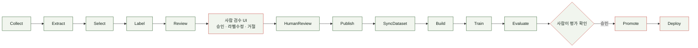

# 실행 가이드 — SortMaster A to Z 셋업

이 문서는 **저장소만 받으면 처음 보는 사람도 A부터 Z까지 직접 실행해볼 수 있게** 만드는 게
목표입니다. 프로젝트 소개·실측 데이터·데모·팀 정보는 메인 [README](../README.md)를
참고하세요. "왜 이렇게 설계했는지" 같은 배경·경위는 여기서 반복하지 않고 각 절 끝에 있는
문서로 연결합니다 — 같은 내용을 두 곳에 적으면 반드시 갈라지기 때문입니다(팀 컨벤션).

## 목차

1. [빠른 시작 — 하드웨어 없이 A to Z 실행해보기](#빠른-시작--하드웨어-없이-a-to-z-실행해보기)
2. [Docker Compose로 전체 스택 실행](#docker-compose로-전체-스택-실행)
3. [테스트 실행](#테스트-실행)
4. [실기기 연결 — 라즈베리파이(엣지)](#실기기-연결--라즈베리파이엣지)
5. [실기기 연결 — GPU 서버(상시 추론)](#실기기-연결--gpu-서버상시-추론)
6. [자동 라벨링 검증용 LLM 서버 (vLLM)](#자동-라벨링-검증용-llm-서버-vllm)
7. [자동 재학습 파이프라인 (autoTraining)](#자동-재학습-파이프라인-autotraining)
8. [RPA 자동화](#rpa-자동화)
9. [관리자 웹 페이지](#관리자-웹-페이지)
10. [배포 전략(운영 토폴로지)](#배포-전략운영-토폴로지)
11. [구현 상태 — 무엇이 어디까지 됐는지](#구현-상태--무엇이-어디까지-됐는지)
12. [문서 지도 — 더 깊은 내용은 어디에 있는지](#문서-지도--더-깊은-내용은-어디에-있는지)
13. [TBD (팀 논의 필요)](#tbd-팀-논의-필요)

## 빠른 시작 — 하드웨어 없이 A to Z 실행해보기

라즈베리파이나 GPU 서버가 없어도, 이 저장소와 노트북 웹캠(또는 웹캠 없이도) 하나만으로
전체 흐름을 처음부터 끝까지 확인할 수 있습니다.

### 1) 필수 설치 확인

| 항목 | 버전 |
|---|---|
| Python | **3.11** (다른 버전 금지 — 라이브러리 호환성) |
| Docker / Docker Compose | Compose **V2** (`docker compose version`으로 확인, V1 standalone `docker-compose`는 불가) |
| Git | 최신 |
| ffmpeg | PATH에 있으면 충분 (RTSP 카메라 디코딩용 서브프로세스) |

```bash
python --version   # 3.11.x
docker --version
docker compose version
git --version
```

### 2) 저장소 클론 + `.env` 준비

```bash
git clone <이 저장소 URL>
cd SortMaster
cp .env.example .env
```

`.env.example`은 안전한 로컬 기본값(`MONGO_HOST=localhost`, `DB_NAME=sortMasterTest`,
`CAMERA_SOURCE_ELEVTOP=0`=로컬 웹캠)으로 채워져 있어 그대로 써도 됩니다. 팀 배포 서버에
접속하려면 Notion에 공유된 실제 값(`MONGO_HOST`, `DB_USER`/`DB_PASSWORD` 등)으로 바꿉니다.

### 3) 로컬 MongoDB 띄우기

```bash
docker compose --profile local up -d mongo
```

호스트 포트 `27020`으로 뜹니다(컨테이너 내부는 27017 유지 — 팀 간 포트 충돌 방지).

### 4) Python 환경 준비 (`infra/checkEnv.py`)

이 프로젝트는 별도 `requirements.txt`가 없습니다 — `infra/checkEnv.py` 하나가 패키지 목록
관리·자동 설치·버전 체크·Docker/ffmpeg 설치 여부·MongoDB 접속까지 한 번에 확인합니다.

```bash
cd WebApps/backend
python -m venv venv
venv\Scripts\activate          # Windows
# source venv/bin/activate     # macOS/Linux

python ..\..\infra\checkEnv.py
```

전부 OK가 나올 때까지 여기서 먼저 해결합니다(더블클릭 실행은 `infra/checkEnv.bat`).

### 5) 백엔드 실행

```bash
uvicorn main:app --reload --port 8047
```

브라우저에서 `http://localhost:8047` 접속 — 실시간 모니터링 화면이 뜨면 성공입니다.
`CAMERA_SOURCE_ELEVTOP`이 기본값 `0`이라 노트북 내장 웹캠이 바로 TOP 화면에 잡힙니다.
`CAMERA_SOURCE_ELEVSIDE` 등 나머지 지점은 값을 채우지 않으면 그 지점만 503을 반환합니다
(정상 동작 — 전체가 죽지 않습니다).

### 6) (선택) 웹캠 여러 대로 라즈베리파이 흉내내기

노트북/USB 웹캠이 여러 대 있다면, 실제 라즈베리파이가 하는 "캡처 → RTSP 송신" 역할을
그대로 흉내내는 시뮬레이터가 있습니다.

```bash
python debug/streaming/startRtspSim.py
```

ffmpeg·MediaMTX를 자동 설치하고, 감지된 카메라마다 지점(`ELEV-TOP`/`ELEV-SIDE`)을 골라
RTSP로 송신을 시작합니다. 끝나면 `.env`에 넣을 `CAMERA_SOURCE_*` 줄을 화면에 출력해줍니다.
Windows 전용(DirectShow 기반)입니다. 자세한 내용: `debug/streaming/README.md`.

### 7) (선택) GPU/실카메라 없이 오분류·넘침 이벤트 만들어보기

GPU 서버의 실제 판정 코드를 백엔드가 그대로 호출하는 서비스 진입점을 로컬에서 직접
불러서, 이벤트가 DB에 쌓이고 `/statistics`·`/events` 화면에 반영되는 전체 흐름을
확인할 수 있습니다(반드시 프로젝트 루트에서, backend venv를 활성화하고 실행).

```bash
python debug/detection/simulateEventPipeline.py       # 오분류(misclassification) 이벤트
python debug/detection/simulateBinStatePipeline.py    # 통 상태(NORMAL→FULL→NORMAL) 전환
```

`http://localhost:8047/statistics`, `http://localhost:8047/events`에서 결과를 바로 볼 수
있습니다. **주의**: 실제 DB에 씁니다 — `.env`의 `MONGO_HOST`/`DB_NAME`이 팀 배포 서버가
아니라 로컬(`localhost`/`sortMasterTest`)을 가리키는지 먼저 확인하세요. 자세한 내용:
`debug/detection/README.md`, DB 관련 안전장치는 `debug/db/README.md`.

여기까지 하면 "카메라 캡처 → 스트리밍 → (모의)판정 → DB 저장 → 웹 UI 표시"까지 하드웨어
없이 A to Z를 한 번 다 돌려본 것입니다. 실제 YOLO 추론·라즈베리파이·GPU 서버 연결은 아래
[실기기 연결](#실기기-연결--라즈베리파이엣지) 절부터 이어집니다.

## Docker Compose로 전체 스택 실행

로컬에서 uvicorn을 직접 띄우는 대신, 백엔드+DB+RPA 스케줄러까지 한 번에 띄우려면:

```bash
# .env는 프로젝트 루트에 있어야 함
docker compose --profile local up --build
```

`--profile local`은 필수입니다 — profile 없이 `docker compose up`을 치면 **아무것도 안
뜹니다**(로컬/GPU 서버가 같은 compose 파일을 공유하므로, 잘못된 환경에서 잘못된 서비스가
뜨는 걸 막기 위한 의도적 설계).

| 서비스 | 역할 |
|---|---|
| `backend` | FastAPI, 포트 8047 |
| `mongo` | MongoDB 7.0, 호스트 포트 27020 |
| `report-scheduler` | 일일 09:00 / 주간 월 09:10 통계 보고서 이메일 발송 |
| `collection-scheduler` | 통 FULL 감지 시 수거 담당자 알림·재알림·에스컬레이션 |

이 `mongo`는 **로컬 전용 별도 인스턴스**입니다 — 팀 배포 서버 DB와는 다릅니다. 배포 서버
DB를 쓰려면 `.env`의 `MONGO_HOST`를 그쪽으로 두고 `mongo` 서비스는 안 띄워도 됩니다:

```bash
docker compose --profile local up backend report-scheduler collection-scheduler
```

## 테스트 실행

```bash
cd WebApps/backend
venv\Scripts\activate
python -m pytest
```

`pytest`는 `infra/checkEnv.py`가 설치합니다. 테스트 파일명이 프로젝트 컨벤션대로
camelCase(`testEventMediaService.py`)라 `WebApps/backend/pytest.ini`가 탐색 패턴을
재정의합니다 — **반드시 `WebApps/backend`에서 실행**해야 합니다(다른 위치면 `no tests
ran`이 뜨거나 import가 깨집니다). MongoDB 없이 전부 mock으로 도는 단위 테스트라 DB를
띄울 필요는 없습니다.

RPA·debug 테스트는 저장소 루트에서 실행합니다(루트 `pytest.ini`가 `RPAs`와
`debug/detection`만 대상으로 잡습니다 — `debug/db/testCrud.py` 등은 손으로 돌리는 MongoDB
스크립트라 제외):

```bash
python -m pytest
```

`tzdata` 미설치 상태면 무더기로 실패합니다 — 어느 쪽을 돌리든 `python infra/checkEnv.py`를
먼저 실행하세요.

## 실기기 연결 — 라즈베리파이(엣지)

**메인보드(라즈베리파이) 코드는 이 저장소가 아니라 별도 저장소**입니다(`webcamViewer.py`
등). 라즈베리파이는 추론을 하지 않고 **캡처 + RTSP 송신 + 스피커**만 담당합니다(전구/LED는
GPIO 제약으로 방향에서 완전히 제외됨).

핵심 절차만 요약하면:

1. Raspberry Pi OS 64-bit(Bookworm 이후) SD카드를 굽고 헤드리스 부팅 설정
2. MediaMTX + ffmpeg를 systemd 서비스로 등록해 캡처→RTSP 송신을 자동 기동
   ```bash
   sudo systemctl enable --now mediamtx.service
   sudo systemctl enable --now webcam-rtsp-push.service
   ```
3. 로컬 백엔드의 `.env`에서 해당 지점의 `CAMERA_SOURCE_<CameraId>`를 라즈베리파이의
   RTSP 주소로 교체(코드 변경 불필요) — 예: `CAMERA_SOURCE_ELEVTOP=rtsp://<PI_IP>:8554/ELEV-TOP`
   - Docker로 배포한다면 컨테이너 안에서 mDNS(`.local`)가 안 통하므로 호스트이름 대신
     라즈베리파이에 **고정 IP**를 설정해야 합니다.
4. 알림 수신용 스피커 리스너(검증용, 상시 서비스화는 아직):
   ```bash
   python3 debug/hardware/alertListener.py --webSocketUrl ws://<LOCAL_BACKEND_IP>:8047/ws/events
   ```

RTSP는 **로컬 백엔드로만** 보냅니다 — 라즈베리파이가 GPU 서버와 직접 연결되지는 않습니다.
SD카드 굽기부터 고정 IP·트러블슈팅까지 전체 실전 절차: `.agentfiles/piSetupOps.md`
(요약본) / `Docs/skills/piSetupOps/README.md`(원본, 처음 셋업할 때는 이쪽을 볼 것).
스피커 단독 테스트: `debug/hardware/README.md`.

## 실기기 연결 — GPU 서버(상시 추론)

GPU 서버는 로컬 백엔드가 서빙하는 MJPEG 스트림(`GET /api/stream/{cameraId}`)을 SSH 역터널로
구독해서 YOLO26+BoT-SORT(TOP, `models/trashdetect/tracking2.py`)와 MobileNet_V3_Small(SIDE,
`models/trashoverflow/sideOverflow.py`)로 자체 판정한 뒤, 결과를 로컬 백엔드로 다시
POST합니다(`POST /api/events/aiDisposal`, `POST /api/binStates`).

### 가중치 파일

`bestTop.pt`/`bestSide.pt`는 `.gitignore` 대상이라 저장소에 없습니다 — 팀원에게 받아 GPU
서버의 `WebApps/backend/models/trashdetect/`, `WebApps/backend/models/trashoverflow/`에
각각 둬야 추론이 됩니다.

### SSH 역터널 (2222 외 포트포워딩 불가인 학교 공용 서버 기준)

```bash
# GPU가 로컬 백엔드의 MJPEG 스트림을 구독하고 판정 결과를 돌려보내는 방향
ssh -p 2222 -R 27020:localhost:27020 -R 8299:localhost:8047 soma@<GPU_SERVER_IP>
```

`-R 27020`은 GPU 서버의 재학습 코드가 로컬 MongoDB의 학습 원본 이미지를 직접 조회하기
위한 것, `-R 8299`는 GPU의 판정 결과 POST가 로컬 백엔드(8047)로 도달하기 위한 것입니다.

### 상시 추론 기동

```bash
docker compose --profile gpu up -d
```

`inference`(TOP) + `side-overflow`(SIDE) 두 서비스가 뜹니다. `.env`의 `GPU_DEVICE_ID`가
우리 팀에 할당된 카드 번호(`nvidia-smi`로 확인)와 맞는지 반드시 먼저 확인하세요 — 안 맞으면
다른 팀 카드를 잡을 수 있습니다(카드는 L40S 4장 중 1장만 할당).

계정 생성부터 rootless Docker, 카드/포트 충돌 확인, 컨테이너 기동 전 체크리스트까지 전체
실전 절차·트러블슈팅: `.agentfiles/gpuServerOps.md`(이 문서가 원본입니다).

## 자동 라벨링 검증용 LLM 서버 (vLLM)

실시간 탐지 경로에는 LLM을 쓰지 않습니다. `autoTraining`의 재학습 준비 단계(Review)가
자동 라벨링 결과를 Qwen3-VL-8B로 검증할 때만 GPU 서버에서 vLLM을 띄웁니다. 보통은 `review`
단계가 필요할 때 알아서 기동·종료하므로 아래 명령을 직접 칠 일은 드뭅니다(최초 1회 가중치
다운로드를 미리 끝내두고 싶을 때, 또는 문제를 직접 진단할 때만):

```bash
docker compose --profile llm up -d llm
docker compose logs -f llm
curl -s http://localhost:${LLM_PORT:-8099}/v1/models | python3 -m json.tool
```

노트북(Windows)엔 GPU가 없어 이 컨테이너는 **반드시 GPU 서버에서** 띄웁니다. 자세한 내용:
`.agentfiles/gpuServerOps.md`의 "vLLM(`llm` 서비스) 기동".

## 자동 재학습 파이프라인 (autoTraining)

CCTV 이벤트 영상에서 신규 학습 후보를 뽑아 자동 라벨링 → Qwen 검수 → 사람 승인 →
MongoDB 학습 데이터 등록 → YOLO 재학습 → 평가 → 승격 → 배포까지 잇는 13단계 CLI
파이프라인입니다.



가장 간단한 실행은 하루치 배치를 한 번에 돌리는 것입니다(사람 검수 구간에서 대기):

```powershell
cd <SORTMASTER_ROOT>
conda activate env_py311
python autoTraining\trainingPipeline.py runDaily --batchId <YYYY-MM-DD>
```

Promote(모델 승격)와 Deploy(운영 모델 교체)는 `runDaily`에 포함되지 않고 사람이 평가
결과를 보고 별도로 실행합니다. **Publish/Deploy는 실제 운영 DB·운영 모델에 영향을
주므로**, 처음 실행 전에 반드시 `autoTraining/README.md`의 "실행 전 필수 확인" 절을
읽어보세요. 전체 단계별 명령, 산출물 구조, 현재 자동화 수준, 남은 검증 작업까지 전부
그 문서에 있습니다(이 README에서 반복하지 않습니다).

## RPA 자동화

`.env`에서 기본적으로 꺼져 있고(`RPA_*_ENABLED=false`), 켜면 Docker Compose의
`report-scheduler`/`collection-scheduler`가 상시 동작합니다.

| RPA | 트리거 | 하는 일 | 자세히 |
|---|---|---|---|
| 통계 보고서 이메일 | 일일 09:00, 주간 월 09:10 | `GET /api/statistics`/`GET /api/events`만 읽어 HTML 이메일 + CSV 생성·발송 | `RPAs/reportAutomation/README.md` |
| 수거 업무 자동화 | 통 상태 `NORMAL→FULL` 전환 | 수거 작업 생성, 담당자 알림·재알림·관리자 에스컬레이션 | `RPAs/collectionAutomation/README.md` |

수거 업무 자동화는 `RPA_COLLECTION_ENABLED=true`로 바꾸고 `backend`+`collection-scheduler`를
재시작해야 새 `FULL` 전환부터 동작합니다. 통계 보고서 수신 이메일은 `/statistics` 화면의
"이메일 설정" 버튼으로도 지정할 수 있습니다(대시보드 설정이 `.env`의
`RPA_REPORT_RECIPIENTS`보다 우선).

## 관리자 웹 페이지

같은 FastAPI 서버가 Jinja2로 렌더링합니다(별도 프론트엔드 빌드 없음).

| 경로 | 화면 |
|---|---|
| `/` | 실시간 모니터링 — 지점별 카메라 화면, 모드(MANAGE 등) |
| `/events` | 이전 기록 — 오분류·넘침 이벤트 목록 |
| `/statistics` | 통계 대시보드 — 집계 통계, 보고서 이메일 설정, 수거 작업 확인·완료 처리 |

API 상세 스펙: `.agentfiles/apiSpec.md` / `Docs/API_SPEC.md`.

## 배포 전략(운영 토폴로지)

**백엔드+DB는 로컬 고정 서버, GPU 서버는 추론+학습+LLM 검증 전담.**

| 환경 | 기동 |
|---|---|
| 개발 | Windows 노트북 + Docker, 로컬 웹캠 |
| 로컬 배포 | `docker compose --profile local up -d backend mongo report-scheduler collection-scheduler` |
| GPU 서버 — 상시 추론 | `docker compose --profile gpu up -d` (`inference` + `side-overflow`) |
| GPU 서버 — 온디맨드 | `docker compose --profile training up` / `--profile llm up` (학습·라벨링 검증 돌 때만) |

profile 없이 `docker compose up`을 치면 아무것도 안 뜹니다(의도적 설계, 위 참고). 전환
경위와 아직 남은 재검증 항목: `Docs/ARCHITECTURE.md`의 "배포 전략".

## 구현 상태 — 무엇이 어디까지 됐는지

> MVP 데모(수동 HTTP 스텁으로 이벤트 플로우 시연)는 끝났고, 실기기 통합·LLM 자동 라벨링
> 검증 등 고도화 단계가 진행됐습니다. "왜 이렇게 설계했는지"는 `Docs/ARCHITECTURE.md`에
> 있고 여기서 반복하지 않습니다.

| 기능 | 상태 | 주요 코드 |
|---|---|---|
| 영상 소스(MJPEG 스트리밍) | 구현됨 | `streaming/cameraManager.py` |
| 탐지 — TOP(오분류) | GPU→백엔드 end-to-end 검증 완료. 상시 서비스화·ROI 재보정 TBD | `models/trashdetect/tracking2.py` |
| 탐지 — SIDE(넘침) | 위와 동일 | `models/trashoverflow/sideOverflow.py` |
| 이벤트 트리거 녹화 | 구현됨(상시 녹화 아님, 최대 30초 안전 캡) | `services/recordingService.py` |
| GIF 인코딩·GridFS 업로드 | 구현됨 | `services/mediaService.py` |
| 사람 존재 감지 게이팅 | 구현됨. 임계값·디바운스 실측 튜닝 TBD | `detection/presenceDetector.py` |
| 방문 클립(`visitClips`) 저장 | 구현됨. GPU 트랙 신호 실기기 도달 검증 아직 | `services/visitClipService.py` |
| GPU 하트비트(헬스체크) | 구현됨. 30초/90초 수치 튜닝 TBD | `services/gpuHeartbeatService.py` |
| API·저장소 | 구현됨(Motor 기반) | `controllers/api.py`, `repositories/eventRepository.py` |
| 자동 통계 보고서 | 구현됨 | `RPAs/reportAutomation/` |
| 수거 업무 자동화 RPA | 구현됨(기본 비활성) | `RPAs/collectionAutomation/` |
| 스피커 경고음 | 프로토타입 존재, 실이벤트 연동 확인됨. 상시 서비스화 미착수 | `debug/hardware/alertListener.py` |
| 전구/LED | 방향에서 완전히 제외(GPIO 제약) | — |
| 자동 재학습 파이프라인 | 구현됨(단계별 CLI). 운영 DB 적용·전체 사이클 검증은 아직 | `autoTraining/` |
| LLM 자동 라벨링 검증 | 사용 중. 파인튜닝은 미착수 | `autoTraining/stages/reviewLabels.py` |
| DB | 구현됨 | `repositories/mongoClient.py`, `Docs/ERD.md` |

이벤트는 `misclassification`(투기)/`overflow`(넘침) 두 카테고리입니다. `overflow`에는
영상이 붙지 않습니다(이유: `Docs/ARCHITECTURE.md`의 "이벤트 적재").

## 문서 지도 — 더 깊은 내용은 어디에 있는지

| 문서 | 다루는 내용 |
|---|---|
| `Docs/ARCHITECTURE.md` | 왜 이렇게 설계했는지, 전환 경위, 각 컴포넌트 설계 배경 |
| `Docs/API_SPEC.md` / `.agentfiles/apiSpec.md` | 전체 API 엔드포인트 스펙 |
| `Docs/ERD.md` | MongoDB 컬렉션·필드 구조 |
| `Docs/DATASET_DESCRIPTION.md` | 학습 데이터셋 설명 |
| `Docs/LLM.md` | Qwen3-VL 자동 라벨링 검증 활용 방식 |
| `.agentfiles/decisionLog.md` | 설계가 바뀐 경위(왜 A였다가 B로 갔는지) |
| `.agentfiles/naming.md` | 네이밍 컨벤션 |
| `.agentfiles/envSetup.md` | 환경 버전 고정 정책, 포트, `.env` 접속 대상 규칙 |
| `.agentfiles/piSetupOps.md` / `Docs/skills/piSetupOps/README.md` | 라즈베리파이 셋업 절차·트러블슈팅(후자가 원본) |
| `.agentfiles/gpuServerOps.md` | GPU 서버 운영 절차·트러블슈팅(원본) |
| `training/README.md` | 초기 학습 데이터 준비 유틸(프레임 추출·라벨링·증강·분할) — 개인 PC 절대경로 하드코딩된 수동 실행용, `autoTraining/`과 별개 |
| `autoTraining/README.md` | 자동 재학습 파이프라인 전체(원본) |
| `RPAs/reportAutomation/README.md` | 통계 보고서 이메일 RPA |
| `RPAs/collectionAutomation/README.md` | 수거 업무 자동화 RPA |
| `debug/db/README.md` | 로컬 MongoDB 접속·CRUD 테스트 |
| `debug/detection/README.md` | 이벤트/통 상태 파이프라인 시뮬레이터 |
| `debug/streaming/README.md` | 웹캠으로 라즈베리파이 RTSP 흉내내기 |
| `debug/hardware/README.md` | 스피커 단독 테스트 |
| `Docs/skills/github/README.md` | 브랜치 전략 |

## TBD (팀 논의 필요)

미해결 항목은 `Docs/ARCHITECTURE.md`의 "TBD" 한 곳에서 관리합니다(여기 옮겨 적으면
갈라집니다). 이 README 범위에서 자주 묻는 것만:

- **오탐 confidence threshold**는 `.env` 값이 아니라 GPU 스크립트 안의 상수입니다
  (`sideOverflow.py`의 `CONFIDENCE_THRESHOLD`, `tracking2.py`의 `CONFIDENCE`/
  `NEW_TRASH_CONFIDENCE`).
- `services/rpaService.py` 미작성 — 스피커 경고음의 상시 서비스화(자동 트리거)는 아직
  없습니다(위 상태 표). 전구(LED)는 라즈베리파이 GPIO 제약으로 방향에서 완전히
  제외되어 더 이상 TBD가 아닙니다.

MongoDB·Docker/Compose 버전은 더 이상 TBD가 아닙니다 — `mongo:7.0`, Compose V2로 확정됐습니다.
