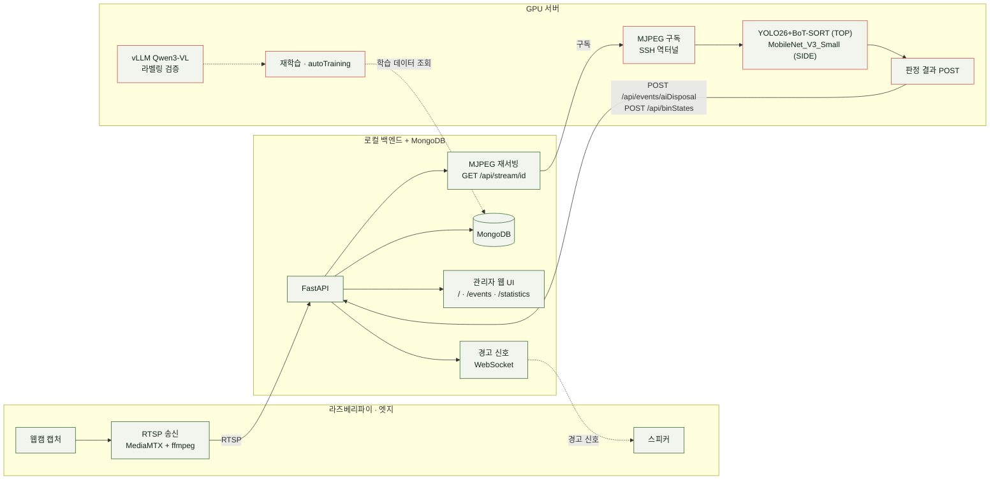

# SortMaster — CCTV 기반 분리수거 오분류 탐지·자동 경고 시스템

> 무인 분리수거장에서 오분류나 통 넘침이 생겨도, 사람이 계속 지켜보지 않는 이상 아무도
> 모릅니다. SortMaster는 카메라 두 대로 그 순간을 놓치지 않고 실시간으로 잡아내
> 관리자에게 바로 알립니다.

## 실측 데이터

팀이 배포한 서버에서 실제로 쌓인 이벤트 로그를 기준으로 한 수치입니다.

| 관측 기간 | 오분류 탐지 | 총 방문 |
|:---:|:---:|:---:|
| **2일** | **48건** | **1,066회** |

*(팀 배포 서버 `events`/`visitClips` 컬렉션 실측값, `debug/db/summarizeEventHistory.py`로 집계)*

## 데모

> 🎬 데모 영상 추가 예정 — 발표 PPT에 쓰인 최종 데모 영상을 이 자리에 GIF 또는 임베드
> 링크로 넣을 예정입니다.

## 무엇을 만들었나

카메라가 무엇을 어느 통에 버렸는지 스스로 판정하고, 통이 찼는지까지 지켜보는 시스템입니다.
TOP 카메라는 YOLO26 + BoT-SORT로 투입 순간을 추적·판정(오분류 탐지)하고, SIDE 카메라는
MobileNet_V3_Small로 통 포화 상태를 판정(넘침 탐지)합니다. 잘못 버려지거나 통이 차면
관리자 웹 대시보드와 스피커로 실시간 알림이 갑니다. 재학습 데이터의 자동 라벨링 검증에는
Qwen3-VL-8B를 쓰는 자동 재학습 파이프라인도 갖췄습니다.

## 시스템 구조

세 종류의 물리적 위치(라즈베리파이 · 로컬 백엔드 · GPU 서버)로 역할이 겹치지 않게
나뉘어 있습니다.

라즈베리파이는 추론 없이 캡처·RTSP 송신·스피커만 담당하고, 로컬 백엔드가 스트림을
재서빙하며 이벤트·통계·대시보드를 책임집니다. GPU 서버는 그 스트림을 SSH 역터널로 구독해
자체 판정하고 결과만 백엔드로 돌려보냅니다. 설계 배경과 전환 경위는
[`Docs/ARCHITECTURE.md`](Docs/ARCHITECTURE.md)에 정리했습니다.

## 핵심 기능

- **실시간 오분류 탐지** — YOLO26 + BoT-SORT로 투입 순간을 추적해 어느 통에 무엇이
  들어갔는지 판정하고, GPU→백엔드 end-to-end 검증까지 마쳤습니다.
- **통 포화(넘침) 감지** — MobileNet_V3_Small로 SIDE 카메라 화면에서 통이 찼는지
  판정합니다.
- **실시간 알림** — 오분류·넘침 발생 시 WebSocket으로 관리자 웹에 즉시 반영되고,
  스피커 경고음으로도 이어집니다.
- **자동 재학습 파이프라인** — 이벤트 영상에서 신규 학습 후보를 뽑아 자동 라벨링 →
  Qwen3-VL-8B 검증 → 사람 승인 → 재학습 → 평가 → 배포까지 잇는 13단계 CLI 파이프라인.
- **운영 자동화(RPA)** — 통계 보고서 이메일 자동 발송, 통 FULL 전환 시 수거 담당자
  알림·재알림·에스컬레이션.
- **관리자 대시보드** — 실시간 모니터링·이전 기록·통계를 같은 서버가 Jinja2로 렌더링.

더 세세한 구현 현황(무엇이 어디까지 검증됐는지)은
[`Docs/SETUP.md`의 구현 상태 표](Docs/SETUP.md#구현-상태--무엇이-어디까지-됐는지)에
정리돼 있습니다.

## 활용 분야

- 공공장소 쓰레기통이 넘치거나 잘못 분류되면 관리자에게 실시간 메시지 발송
- 관광지 비성수기: 쓰레기통이 차 있지 않으면 수거 차량이 방문을 건너뛰어 운영비 절감
- 대단지·캠퍼스 등 다수의 분리수거장을 사람이 상시 순찰하지 않아도 되는 무인 모니터링

## 기술 스택

| 영역 | 기술 |
|---|---|
| 탐지 · 추적 (TOP) | YOLO26, BoT-SORT |
| 탐지 (SIDE) | MobileNet_V3_Small |
| 자동 라벨링 검증 | Qwen3-VL-8B (vLLM) |
| 백엔드 | FastAPI, MongoDB(Motor) |
| 프론트엔드 | Jinja2, Vanilla JS (별도 빌드 없음) |
| 스트리밍 | MediaMTX, ffmpeg, RTSP → MJPEG |
| 인프라 | Docker Compose (`local`/`llm`/`training`/`gpu` profile) |
| 자동화 | RPA(통계 보고서·수거 업무), WebSocket 실시간 알림 |

## 팀

5명이 함께 만들었습니다. 영상 파이프라인·탐지 모델·백엔드·데이터 라벨링을 각자 맡아
GPU 서버 실기기 통합과 자동 재학습까지 이어지는 end-to-end 시스템으로 완성했습니다.

| 이름 | 역할 | 주요 기여 |
|---|---|---|
| 김동수 | PM | 프로젝트 일정 관리, 팀 커뮤니케이션 및 발표 총괄 |
| 윤혜진 | CTO · 시스템 아키텍처 · 인프라 전반 | 시스템 아키텍처 설계, 영상 스트리밍·GPU 인프라 구축, 백엔드-GPU 연동, LLM 자동 라벨링 검증 (아래 "내 역할" 참고) |
| 백욱진 | 통 넘침 판정 로직 | SIDE 카메라 MobileNet_V3_Small 기반 통 포화(넘침) 판정 모델 구현 |
| 서동찬 | 백엔드 API · 실시간 동기화 | FastAPI API 설계, MongoDB 연동, WebSocket 기반 실시간 알림 구현 |
| 이원지희 | 데이터 · 라벨링 파이프라인 | 학습 데이터셋 구축, 라벨링·증강·분할 파이프라인 구현 |

### 내 역할 — 윤혜진 (CTO)

시스템 아키텍처 설계부터 인프라 구축까지 전반을 담당했습니다.

- **시스템 아키텍처 설계** — 라즈베리파이 · 로컬 백엔드 · GPU 서버 3단 구조와 통신 규약
  (RTSP → MJPEG 재서빙 → SSH 역터널 구독)을 설계했습니다.
- **영상 스트리밍 인프라** — RTSP 스트림 수신, ffmpeg 서브프로세스 격리·재시작, MJPEG
  재서빙 파이프라인을 구현·안정화했습니다.
- **GPU 서버 인프라 구축** — SSH 역터널 기반 스트림 구독 환경, Docker Compose profile
  (`gpu`/`llm`/`training`) 구성, GPU 판정 결과를 백엔드로 되돌리는 연동
  (`POST /api/events/aiDisposal`, `POST /api/binStates`)을 구현했습니다.
- **LLM 자동 라벨링 검증** — vLLM 기반 Qwen3-VL-8B 서빙 환경을 구축하고, 자동 재학습
  파이프라인의 Review(라벨 검증) 단계를 구현했습니다.
- **팀 문서·컨벤션 인프라(`.agentfiles/`)** — 네이밍 규칙, 환경 설정, 운영 절차를 팀이
  공유하는 문서 체계로 구축했습니다.

## 더 알아보기

| 문서 | 내용 |
|---|---|
| [`Docs/SETUP.md`](Docs/SETUP.md) | 하드웨어 없이 A to Z 직접 실행하는 방법 (전체 실행 가이드) |
| [`Docs/ARCHITECTURE.md`](Docs/ARCHITECTURE.md) | 왜 이렇게 설계했는지, 전환 경위 |
| [`Docs/API_SPEC.md`](Docs/API_SPEC.md) | 전체 API 엔드포인트 스펙 |
| [`Docs/ERD.md`](Docs/ERD.md) | MongoDB 컬렉션·필드 구조 |
| [`Docs/DATASET_DESCRIPTION.md`](Docs/DATASET_DESCRIPTION.md) | 학습 데이터셋 설명 |
| [`Docs/LLM.md`](Docs/LLM.md) | Qwen3-VL 자동 라벨링 검증 활용 방식 |
